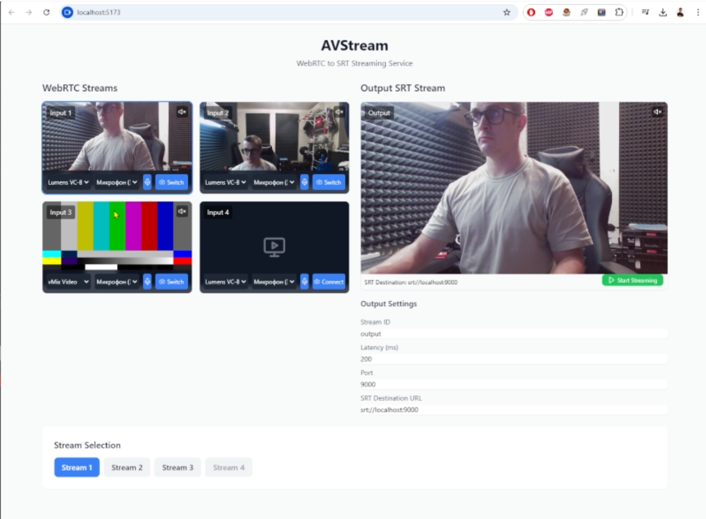

# WebRTC to SRT video mixer

This project provides a video mixer that facilitates the transmission of WebRTC streams to SRT. The project uses FFmpeg for media processing and is designed for integration with other media production software, like vMix of OBS. It works locally, but you are free to deploy it on your cloud server. It has some lag when switching inputs, i hope to fix it soon.



## Preistall

1. Install Node.js LTS from https://nodejs.org/
2. Install FFmpeg from https://ffmpeg.org/download.html#build-windows
   - Add FFmpeg to your system PATH
3. Install Visual Studio Code (recommended)

## Setup

1. Open Command Prompt  as Administrator (or better work in Visual Studio)
2. Navigate to your project folder:
   ```bash
   cd "path\to\your\project"
   ```

3. Run the setup command:
   ```bash
   npm run setup
   ```

4. Start the application:
   ```bash
   npm run dev
   ```

The application will be available at:
- Frontend: http://localhost:5173
- Backend: http://localhost:8080 (not needed)

## Running Application

1. Add your WebRTC sources - web camera and microphone
2. Try switching inputs
3. Click "Start Streaming" button. It runs SRT output
4. Check SRT input in vMix, VLC or OBS

## Testing SRT Output

1. Open vMix
2. Add SRT listener at 9000 port
3. Enjoy

## Troubleshooting

1. If you see "'node' is not recognized":
   - Make sure Node.js is installed
   - Restart your terminal/VS Code
   - If still not working, add Node.js to your PATH manually

2. If you see "Cannot find package 'express'":
   - Run `cd backend && npm install`
   - Then try `npm run dev` again

3. Make sure FFmpeg is properly installed and in your PATH
4. Check that ports 5173 and 8080 are not in use
5. Allow camera access when prompted by the browser

## License and Attribution
This project uses FFmpeg, which is licensed under the LGPL (Lesser General Public License). Please review the license details at https://ffmpeg.org/legal.html for more information.

## Author
The author of this code is Sergey Korneyev. For more information, visit https://avstream.ru or you can PM me at telegram https://t.me/Kvanterbreher

